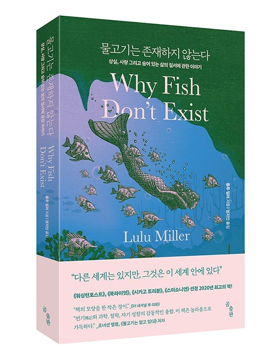

---
# 커버의 타이틀과 서브 타이틀
title: "서울시 인구통계 보고서"
subtitle: "25개 구별 인구통계"
# 커버의 초록 상자를 만듭니다. 간결하게 기술해야 합니다.
# 초록이 없는 전체 이미지 커버를 원한다면, YAML에서 abstract-title와 abstract를 제거합니다.
abstract-title: 보고서 개요
abstract: "본 분석 보고서는 **서울특별시의 25개 구에 대해서 인구통계**에 대한 간략한 분석을 제공합니다. bitReport의 기능의 이해를 위해서 작성된 보고서는 **각 구별 인구수, 면적, 인구밀도, 성별 연령대별 인구통계를 제공**합니다. 분석 결과를 통해 서울시의 인구통계에 대한 이해를 높일 수 있습니다."
# 날짜는 바닥글에서 사용합니다.
date: "`r Sys.Date()`"
# author는 문서를 만드는 사람입니다. 문서에는 나타나지 않지만 DOM의 일부가 됩니다.
# 문서 뒷표지의 연락처는 본 템플리트 뒷부분을 참고해서 수정하세요.
author:
  - name: 홍길동
    affiliation: 조원씨앤아이
    email: <contact1email@jowoncni.com>

output: 
    # bitReport::bitR_blue_paged 템플리트는 파란색 디자인 템플리트도 사용 가능함
  bitReport::bitR_blue_paged: 
    # 커버 페이지의 백그라운드 이미지
    front_cover: img/seoul_tower.jpg
    # 뒷커버 페이지의 백그라운드 이미지
    # violet 테마 경우는 backcover_violet.svg, green 테마 경우는 backcover_green.svg
    # orange 테마 경우는 backcover_orange.svg, blue 테마 경우는 backcover_blue.svg    
    # 아니면 사용자의 백드라운드 이미지를 사용합니다.
    back_cover: img/backcover_blue.svg    
    # 목차를 제거하려면 false로 변경하십시오.
    toc: true
    # 챕터 앞에 숫자를 추가하려면 true로 변경하십시오.
    number_sections: false
    # 리소스 자체 포함문서의 경우네는 true로 지정합니다. 이 경우 Pandoc의 렌더링 속도는 약간 느립니다.
    self_contained: true
# 목차의 제목 설정, 기본값 없음
toc-title: Contents
# 테이블 목록을 제거하려면 false로 변경하십시오
lot: false
# 테이블 목록의 제목 설정, 기본값은 "List of Tables"
lot-title: "Tables"
# 그림 목록을 제거하려면 false로 변경하십시오.
lof: false
# 그림 목록의 제목 설정, 기본값은 "List of Figures"
lof-title: "Figures"
# 문서에 <abbr>을 포함하면 약어 목록이 작성됩니다.
# 약어 목록의 제목 설정, 기본값은 "List of Abbreviations"
loa-title: "Acronyms"
# 관련 페이지에 각주를 포함합니다.
paged-footnotes: true
# PDF 인쇄 시 각주 링크 켜기/끄기
links-to-footnotes: true
# RStudio에서 HTML 및 PDF를 생성하려면 이 줄의 주석 처리를 제거하십시오.:
#knit: pagedown::chrome_print
---

```{r setup, include=FALSE}
knitr::opts_chunk$set(echo = TRUE)
```

```{r packages, include=FALSE, message=FALSE, warning=FALSE}
library(bitReport)
library(tidyverse)
library(scales)

update_geom_font_defaults()
```

```{r create-css, echo=FALSE, message=FALSE, warning=FALSE}
##==============================================================================
## Cover 페이지의 일부 형식과 바닥글의 서식을 지정합니다.
##==============================================================================

## 타이틀의 폰트 색상을 지정합니다.
title_color <- "white"

## 서브 타이틀의 폰트 색상을 지정합니다.
subtitle_color <- "gold"

## 표지 우측 상단의 로고 이미지를 지정합니다.
## 지정하지 않으면, 한국R사용자회 로고를 출력합니다. (교보 CI로 대체됨)
logo_img <- "img/logo_jowoncni.png"

if (is.null(logo_img)) {
  logo_file <- file.path(system.file(package = "bitReport"), "resources", "image", "koRea_logo.png")
  base64_logo <- knitr::image_uri(logo_file)
} else {
  base64_logo <- knitr::image_uri(logo_img)
}

## 문서 하단의 텍스트를 지정합니다.
## 지정하지 않으면, bitReport를 출력합니다.
bottom_txt <- NULL

if (is.null(bottom_txt)) {
  bottom_txt <- "bitReport"
} 

## Back-Cover의 이미지를 지정합니다.
## 지정하지 않으면, 한국R사용자회 이미지를 출력합니다.
## orange 테마의 경우에는 backcover_orange.png, blue 테마인 경우에는 backcover_blue.png를 지정합니다.
## --> 아래 코드에서 수정이 필요함
back_cover <- NULL

if (is.null(back_cover)) {
  back_cover_file <- file.path(system.file(package = "bitReport"), "resources", "image", "backcover_blue.svg")
  base64_back_cover <- knitr::image_uri(back_cover_file)
} else {
  base64_back_cover <- knitr::image_uri(back_cover)
}

str_css <- paste0(
".pagedjs_page.pagedjs_first_page .pagedjs_margin-top-right>.pagedjs_margin-content::after {
    content: url('", base64_logo, "') !important;
}

.title {
  color: ", title_color, ";
  font-size: 3.0em !important;
}

.subtitle {
  color: ", subtitle_color, ";
  font-size: 2.5em !important;  
}

.back-title {
  font-size: 2.8em !important;
}

.back-subtitle {
  font-size: 2.5em !important;
}

.pagedjs_page.pagedjs_named_page.pagedjs_chapter_page.pagedjs_left_page .pagedjs_margin-bottom-right>.pagedjs_margin-content::after {
    content: '", bottom_txt, " / ' var(--pagedjs-string-first-date-text);
}

.pagedjs_page.pagedjs_named_page.pagedjs_chapter_page.pagedjs_right_page .pagedjs_margin-bottom-left>.pagedjs_margin-content::after {
    content: '", bottom_txt, " / ' var(--pagedjs-string-first-date-text);
}

/* Warnings */
.tag {
  display: inline-block;
  padding: 2px 12px;
  border-radius: 5px;
  font-weight: 600;
  font-size: 12px;
}

.recommand-check {
  background: hsl(116, 60%, 90%);
  color: hsl(116, 30%, 25%);
}

.recommand-judgement {
  background: hsl(230, 70%, 90%);
  color: hsl(230, 45%, 30%);
}

.recommand-remove {
  background: hsl(350, 70%, 90%);
  color: hsl(350, 45%, 30%);
}

/* PDF 기본 폰트 설정 - 목차 및 header/footer, back-cover에 적용, #4 */
/* Mac Slicon chip 환경에서 폰트 이슈시 아래 주석을 해제함 */
/*
@media print {
 body {
      font-family: Apple SD Gothic Neo;       
  }
}
*/
")

fileConn <- file("prams.css")
writeLines(str_css, fileConn)
close(fileConn)

htmltools::includeCSS("prams.css")
```

# 교보문고 {#kyobo-book}

```{r table, echo=FALSE, message=FALSE}
books <- read.csv("data/books.csv", stringsAsFactors = FALSE)
```


### 베스트셀러 현황 {#best-seller}

```{css, echo=FALSE}
.bg-blue>*:last-child, .bg-orange>*:last-child, .bg-grey>*:last-child, .bg-green>*:last-child, .bg-violet>*:last-child  {
    margin-top: 0;    
    margin-bottom: 0;
    padding-top: 0;
    padding-bottom: 0;    
}

table {
    caption-side: bottom;
    font-family: 'NanumSquare';
    border-collapse: collapse;
}

.pagedjs_pages > .pagedjs_page > .pagedjs_sheet > .pagedjs_pagebox > .pagedjs_area > div [data-split-from] {
    font-family: 'NanumSquare';
}
```


```{r best-seller, echo=FALSE, message=FALSE, warning=FALSE, cache=TRUE}
knitr::kable(books %>% 
               select(`순위`=popularity_rank, `제목`=title, `저자`=author, 
                      `출판사`=publisher, `페이지`=pages, `출판년도`=release_date),
             table.attr = "class=\"table table-striped-green table-width\"",
             format = "html",
             caption = "과학분야 베스트셀러 현황")
```

:::{.bg-green}
상위에 랭크한 도서는 대부분 번역서이며, 과학관련 주제의 유투버 이과형의 2023년 신간, "이과형의 만만한 과학책"이 유일한 국내 저작 출판물로 이름을 올렸습니다.
:::

#### 베스트셀러 1위 서평 {#best-seller-review}

:::: {style="display:grid; grid-template-columns: 15% 85%; grid-row-gap: 15px; align-self:start"}
::: {style="margin-top: 0px; margin-bottom: 0px;"}

```{r tidyverse, echo=FALSE, out.width = "80%"}

```

:::

::: {style="color:grey; margin-top: 20px;"}

"이 책은 완벽하다. 그냥 완벽하다고 할 수밖에 없다. 서정적인 동시에 지적이고, 개인적인 동시에 정치적이며, 사소하면서 거대하고 별나면서도 심오하다" -- 베스트셀러 '스티프(stiff)의 저자 메리 로치

:::
::::

:::{.col2 style="font-size: 14px !important;"}
"《**[물고기는 존재하지 않는다]{.custom-orange}**》는 세계라는 거대한 구조 속에서 '물고기는(그리고 우리는) 어떤 존재인가'에 관해 우리의 관념을 뒤집어엎으며 자유분방한 여정을 그려나간다. 사랑을 잃고 삶이 끝났다고 생각한 그 순간 ‘데이비드 스탄 조던’을 우연히 알게 된 저자는 그가 혼돈에 맞서 싸우는 것을 전혀 두려워하지 않는 모습에 매혹되어 그의 삶을 추적해나가기 시작한다. 저자 역시 이 세계에서 "혼돈이란 '그런 일이 일어난다면'의 가정의 문제가 아니라 '언제 일어나는가'의 시기의 문제"이며, 어느 누구도 이 진리를 피할 수 없다고 생각해왔기 때문이다. 하지만 조던의 이야기는 독자들을 전혀 예상하지 못한 곳으로 이끌며, 이윽고 엄청난 충격으로 우리의 눈을 번쩍 뜨이게 만든다."
:::


:::{.page-break}
:::


# 인구통계 {#population}

## 면적 및 인구 현황 {#area-pop}

```{css, echo=FALSE}
table {
    font-size: smaller;
}
```

```{r create-pop, echo=FALSE, message=FALSE, warning=FALSE, cache=TRUE}
# 인구, 인구밀도, 면적 데이터 불러오기
stat_population <- read.csv("data/stat_population.csv", stringsAsFactors = FALSE)

# 행정구역 면적 Top 1, Bottom 1 정보 계산
area_top <- stat_population$CTY_NM[which.max(stat_population$area)]
area_bottom <- stat_population$CTY_NM[which.min(stat_population$area)]
multi_area <- round(stat_population$area[which.max(stat_population$area)] /
                      stat_population$area[which.min(stat_population$area)], 0)

# 인구밀도 Top 1, Bottom 1 정보 계산
density_top <- stat_population$CTY_NM[which.max(stat_population$density_pop)]
density_bottom <- stat_population$CTY_NM[which.min(stat_population$density_pop)]
multi_density <- round(stat_population$density_pop[which.max(stat_population$density_pop)] /
                         stat_population$density_pop[which.min(stat_population$density_pop)], 0)
```

행정구역의 **면적**이 가장 넓은 지역은 **`r area_top`**로 가장 좁은 지역인 **`r area_bottom`**보다 약 `r multi_area`배 넓습니다.
**인구밀도**가 가장 높은 지역은 **`r density_top`**로 가장 낮은 지역인 **`r density_bottom`**보다 약 `r round(multi_density, 1)`배 높습니다.

```{r table-pop, echo=FALSE, message=FALSE, warning=FALSE}
knitr::kable(
  stat_population %>% select(-CTY_CD),
  table.attr = "class=\"table table-striped-green\"",
  format = "html",
  col.names = c("구 이름", "인구(명)", "면적(km^2^)", "인구밀도(명/km^2^)"),
  format.args = list(big.mark = ",", digit = 2, scientific = FALSE),
  caption = "구별 면적 및 인구통계 현황")
```

:::{.page-break}
:::

## 성별 인구 현황 {#gender-pop}

```{r create-gender, echo=FALSE, message=FALSE, warning=FALSE, cache=TRUE}
# 성별/연령대별 인구 데이터 불러오기
population_seoul <- read.csv("data/population_seoul.csv", stringsAsFactors = FALSE)

# 성별 인구 비율 계산
population_gender <- population_seoul |> 
  select(CTY_NM, gender, total_pop) |> 
  pivot_wider(names_from = gender, values_from = total_pop) |> 
  mutate(pct_female = female / (female + male) * 100,
         pct_male = male / (female + male) * 100) |> 
  arrange(desc(pct_female))

# 성별 인구 비율 Top 1, Bottom 1 정보 계산
female_top <- population_gender$CTY_NM[which.max(population_gender$pct_female)]
female_top_value <- population_gender$pct_female[which.max(population_gender$pct_female)]

female_bottom <- population_gender$CTY_NM[which.min(population_gender$pct_female)]
female_bottom_value <- population_gender$pct_female[which.min(population_gender$pct_female)]

```

서울특별시 **여성의 인구비율**이 **가장 높은** 지역은 **`r female_top`**로 **`r round(female_top_value, 2)`% **이며, **가장 낮은** 지역은 **`r female_bottom`**로 **`r round(female_bottom_value, 2)`%**입니다.

```{r tab-gender, echo=FALSE, message=FALSE, warning=FALSE}
knitr::kable(
  population_gender,
  table.attr = "class=\"table table-striped-green\"",
  format = "html",
  digits = 2,
  col.names = c("구 이름", "여성 인구", "남성 인구", "여성 인구 비율(%)", "남성 인구 비율(%)"),
  format.args = list(big.mark = ",", scientific = FALSE),
  caption = "구별 성별 인구 현황")
```

:::{.page-break}
:::

```{r fig-gender, echo=FALSE, message=FALSE, warning=FALSE, fig.cap="서울특별시 구 단위의 성별 인구 구성비", dpi=70, fig.height=8, fig.width=5, out.width="85%", fig.align='center'}
fig_gender <- population_gender |> 
  select(CTY_NM, female, male, pct_female) |> 
  mutate(CTY_NM = fct_reorder(CTY_NM, pct_female)) |>
  pivot_longer(cols = -c(CTY_NM, pct_female), names_to = "gender", values_to = "population") |>
  mutate(gender = factor(gender, levels = c("male", "female"), labels = c("남성", "여성"))) |> 
  ggplot(aes(x = CTY_NM, y = population, fill = gender)) +
  geom_col(position = "fill") +
  coord_flip() +
  bitReport::bit_theme(base_family = "NanumSquare") +
  labs(title = "성별 인구 비율", x = "지역", y = "인구 비율",
       fill = "성별") 

fig_gender
```


## 연령별 인구 현황 {#age-pop}

### 연령별 인구 현황 {#age-pop-count}

```{r create-age, echo=FALSE, message=FALSE, warning=FALSE, cache=TRUE}
# 연령별 인구현황 계산
population_age <- population_seoul |> 
  mutate(age_10 = age_0_9 + age_10_19) |>
  mutate(age_60 = age_60_69 + age_70_79 + age_80_89 + age_90_99 + age_100_over) |>
  select(CTY_NM, age_10, age_20_29, age_30_39, age_40_49, age_50_59, age_60) |> 
  group_by(CTY_NM) |>
  summarise_all(sum) |> 
  arrange(desc(age_60))

# 연령별 인구수 Top 1, Bottom 1 정보 계산
age_top <- population_age$CTY_NM[which.max(population_age$age_60)]
age_top_value <- population_age$age_60[which.max(population_age$age_60)]

age_bottom <- population_age$CTY_NM[which.min(population_age$age_60)]
age_bottom_value <- population_age$age_60[which.min(population_age$age_60)]
```

서울특별시의 60세 이상의 **노령인구수**를 보면 **`r age_top`** 지역이 **`r age_top_value`명**으로 **가장 많은** 인구수를 보이며, **`r age_bottom`** 지역이 **`r age_bottom_value`명**으로 **가장 적은** 인구수를 보입니다.

```{r tab-age, echo=FALSE, message=FALSE, warning=FALSE}
knitr::kable(
  population_age,
  table.attr = "class=\"table table-striped-green\"",
  format = "html",
  digits = 2,
  col.names = c("구 이름", "10대이하", "20대", "30대", "40대", "50대", "60대이상"),
  format.args = list(big.mark = ",", scientific = FALSE),
  caption = "구별 성별 인구 현황")
```


:::{.bg-green}
**`r age_top`** 지역의 노령인구가 많은 것은, 해당 지역의 인구가 많아서 일수 있습니다. 그래서 노령인구 비율을 살펴볼 필요가 있습니다.
:::

:::{.page-break}
:::


### 연령별 인구 구성비 현황 {#age-pop-ratio}

```{r create-age-ratio, echo=FALSE, message=FALSE, warning=FALSE, cache=TRUE}
# 연령별 인구 비율 계산
population_age_ratio <- data.frame(CTY_NM = population_age[, "CTY_NM"],
                                   population_age[, -1] / apply(population_age[, -1], 1, sum) * 100) |> 
  arrange(desc(age_60))

# 연령별 인구 비율 Top 1, Bottom 1 정보 계산
age_top_ratio <- population_age_ratio$CTY_NM[which.max(population_age_ratio$age_60)]
age_top_ratio_value <- population_age_ratio$age_60[which.max(population_age_ratio$age_60)]

age_bottom_ratio <- population_age_ratio$CTY_NM[which.min(population_age_ratio$age_60)]
age_bottom_ratio_value <- population_age_ratio$age_60[which.min(population_age_ratio$age_60)]
```

서울특별시의 60세 이상의 **노령인구** 비율을 보면 **`r age_top_ratio`** 지역이 **`r round(age_top_ratio_value, 2)`%**로 **가장 높은** 비율을 보이며, **`r age_bottom_ratio`** 지역이 **`r round(age_bottom_ratio_value, 2)`%**로 **가장 낮은** 비율을 보입니다.

```{r tab-age-ratio, echo=FALSE, message=FALSE, warning=FALSE}
knitr::kable(
  population_age_ratio,
  table.attr = "class=\"table table-striped-green\"",
  format = "html",
  digits = 2,
  col.names = c("구 이름", "10대이하(%)", "20대(%)", "30대(%)", "40대(%)", "50대(%)", "60대이상(%)"),
  format.args = list(big.mark = ",", scientific = FALSE),
  caption = "구별 연령별 인구 구성비 현황")
```

:::{.bg-green}
강남구, 서초구, 송파구 등 **강남 3구의 노령인구 비율이 낮은 것**으로 나타났습니다. 반면, 강북구, 도봉구, 중랑구 등 **강북 3구에 속한 구의 노령인구 비율이 높은 것**으로 나타났습니다.
:::

:::{.page-break}
:::

```{r fig-age, echo=FALSE, message=FALSE, warning=FALSE, fig.cap="서울특별시 구 단위의 연령대별 인구 구성비", dpi=70, fig.height=8, fig.width=5, out.width="85%", fig.align='center'}
fig_age <- population_age_ratio |> 
  select(CTY_NM, age_10, age_20_29, age_30_39, age_40_49, age_50_59, age_60) |> 
  mutate(CTY_NM = fct_reorder(CTY_NM, age_60)) |>
  pivot_longer(cols = -CTY_NM, names_to = "age", values_to = "population") |> 
  mutate(age = factor(age, 
                      levels = c("age_60", "age_50_59", "age_40_49", "age_30_39", "age_20_29", "age_10"), 
                      labels = c("60대+", "50대", "40대", "30대", "20대", "10대-"))) |>   
  ggplot(aes(x = CTY_NM, y = population, fill = age)) +
  geom_col(position = "fill") +
  coord_flip() +
  guides(fill = guide_legend(ncol = 6)) +
  bitReport::bit_theme(base_family = "NanumSquare") +
  labs(title = "연령대별 인구 비율", x = "지역", y = "인구 비율",
       fill = "연령대") 

fig_age
```


## 인구관련 뉴스 분석 {#news-wc}

**"서울시 인구"**를 키워드를 적용한 네이버 뉴스 검색 스크랩으로 1,000건의 뉴스 기사를 수집하여 **워드클라우드**로 시각화하였습니다.

**보행**, **교통**, **교통사고**, **횡단보도**, **버스**와 같은 교통/안전 토픽과 **고령화**, **고령**, **출생**, **감소**와 같은 출산/고령화 이슈가 뉴스에 많이 다루어진 것으로 나타났습니다.

**혁신**, **정책**, **복지**, **활성**, **대응** 등 복지와 정책에 대한 제안 관련 뉴스도 다루어진 것으로 나타났습니다.
 

```{r noun-word, echo=FALSE, message=FALSE, warning=FALSE, include=FALSE}
library(webshot)
library(htmlwidgets)
library(showtext)

showtext_auto()

none_population <- readr::read_csv("data/noun_population.csv")

min_freq <- 3
remove_n <- 3

none_seoul <- none_population |>
  filter(mega %in% "seoul") |>
  filter(n >= min_freq) |>
  filter(row_number() > remove_n) |>
  select(-mega) |>
  wordcloud2::wordcloud2(fontFamily = "NamumSquare")

saveWidget(none_seoul, "tmp.html", selfcontained = FALSE)
webshot("tmp.html", "seoul.png", delay = 5, vwidth = 1200, vheight = 900)
```

```{r news-seoul, echo=FALSE, out.width = "100%", fig.align='center', fig.cap="서울특별시 인구 관련 뉴스 키워드"}
knitr::include_graphics("seoul.png")
```


::: {.back-cover}

::: {.back-header}
<h1 class="back-title"></h1>
<h2 class="back-subtitle"></h2>
:::

::: {.back-footer}
자세한 내용은 다음으로 문의하십시오:

::: {.back-contact}
[홍길동]{.back-name}

데이터분석팀, 02-123-1234

[contact1email@mail.com](mailto:contact1email@mail.com)
:::

:::

:::

